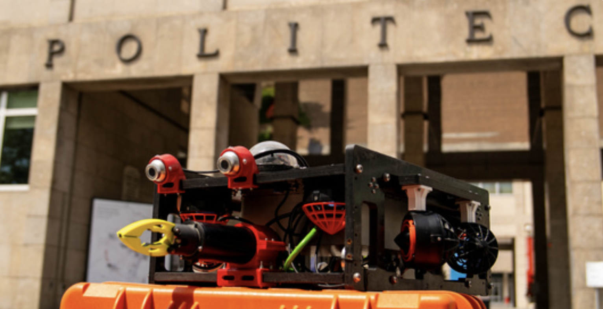
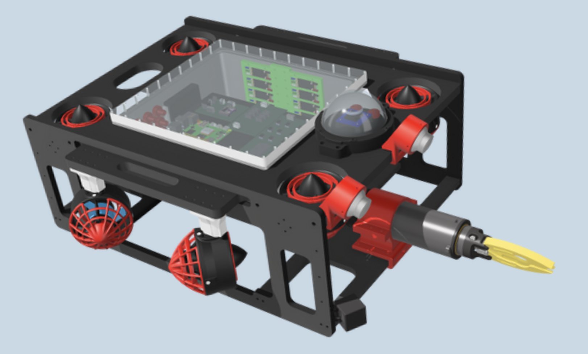
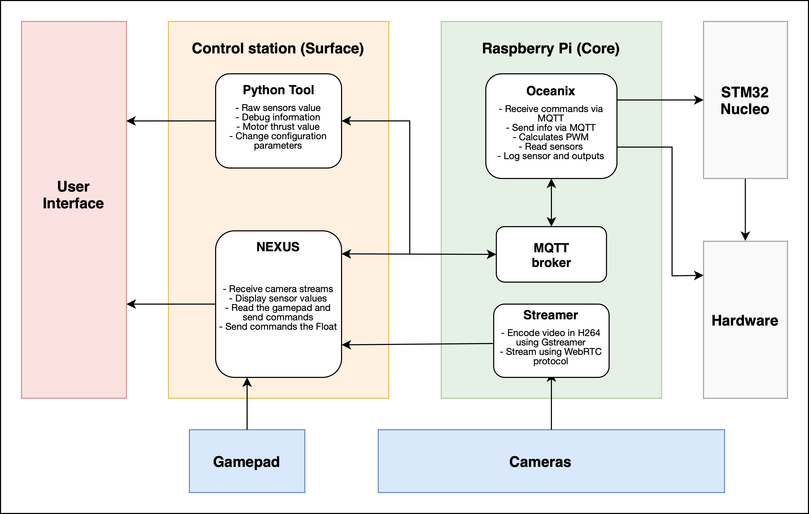

# NEW EVA 2025
EVA is PoliTOcean main ROV ready for MATE Competition.

## Overview
The ROV’s software stack is built around three integrated components: NEXUS, Oceanix, and STM Nucleo firmware. NEXUS, running on the control station, delivers real-time video, telemetry, and control to the pilot. Oceanix, hosted on a Raspberry Pi 5, handles mission logic, sensor fusion, and dynamic thrust allocation. The STM Nucleo executes low-level motor and actuator control via lightweight firmware, offering additional GPIOs with PWM support at very low cost. These components communicate via MQTT, I²C and a custom serial protocol, ensuring modularity, low latency, and robustness.
The decision to adopt the Raspberry Pi 5 over alternatives like the NVIDIA Jetson Nano was driven by its efficiency, lower power consumption, and cost-effectiveness. While the Jetson’s GPU acceleration benefits AI workloads, our architecture prioritizes real-time control, sensor polling and network communication (tasks where the Pi 5's CPU is more than sufficient).  Similarly, the STM Nucleo adds PWM-capable GPIOs and supports a modular architecture at minimal cost. This design allows us to upgrade sensors or control logic with minimal effort, supporting rapid development and scalability.

## NEXUS
NEXUS is implemented as a Flask‑based Python application that delivers a desktop‑style web interface to the ROV pilot. Within the browser window, operators see five live feeds from the Raspberry Pi 5. This year, we upgraded the streaming system to WebRTC, enabling GPU-accelerated rendering of the video directly in the browser. This allowed us to reduce latency by up to 200 ms and add real-time lens distortion correction for improved camera visualization, while fully leveraging the onboard H.264 encoding of the two front cameras. Alongside the video panels, dynamic charts visualize the ROV’s attitude (roll, pitch, yaw) and depth readings from the Bar02 sensor. Float functions are accessed through a dedicated section. Commands, from joystick movements to arm actuation, are serialized as JSON and sent over MQTT to Oceanix. 

## Oceanix
Oceanix is our C++ application running on the Raspberry Pi 5, structured in an object‑oriented paradigm to isolate sensors, controllers and communication services. The Pi hosts a Mosquitto MQTT broker that relays messages between NEXUS, the debug tool and Oceanix itself. Joystick inputs arrive on the command topic, the resulting force and moment vectors feed a thrust allocation algorithm that computes individual PWM setpoints for eight thrusters.
These setpoints are forwarded over a high‑speed UART link to the STM Nucleo board. Simultaneously, Oceanix polls the onboard IMU and Bar02 sensor at 200 Hz via I²C, combining accelerometer, gyroscope and pressure data in a complementary filter to estimate depth and attitude.

## STM Nucleo
On the NUCLEO‑L432KC board, a bare‑metal C application built on ST’s HAL libraries listens on UART for a continuous stream of PWM duty‑cycle values and servo positions sent by Oceanix at 100 Hz. Each packet includes a CRC to verify integrity; in the event of a CRC failure, the firmware retains the previous command until valid data resumes. Hardware timers generate PWM signals with 1 µs resolution, which drive optocouplers feeding our motor driver MOSFETs. For arm control, a specially designed packet is received to regulate the actuator and driver, including their speed and direction. The firmware’s emphasis on deterministic timing and minimal interrupt jitter guarantees that high‑frequency control loops run reliably, enabling both precise thrust control and smooth manipulator operation.

## Helper
For deeper analysis and tuning, we maintain a companion Python/Tk debug tool that connects via MQTT to display raw sensor dumps, per‑motor thrust values, live logs and adjustable control‑loop parameters such as controller gains. This app is divided into windows, is very good for lab testing since all essentials commands can be send to Oceanix, also statuses are printed along with real time plot for controller tuning, camera streamning can be tested and snapshot can be taken, also the configuration page edits the config.json on the Raspberry Pi.

# Usage
For detailed instructions on operating EVA, see the [usage.md](usage.md) file.

# Installation
Go the the folder [tutorials](./tutorials/) to have a complete overview of the installation process and camera configuration on the Raspberry PI.

Here the repo with the most important code:
- [NEXUS Repository](https://github.com/PoliTOcean/nexus)
- [Oceanix Repository](https://github.com/PoliTOcean/oceanix)

# TODO
## Improvements for Next Year

- **Implement Motor Safety Timeout:** Update the STM Nucleo firmware to include a timeout mechanism. If no valid motor command is received within a set interval, automatically stop the motors to prevent unintended movement.
- **Optimize CPU Usage:** Investigate and resolve high CPU load on the Raspberry Pi 5. Profile Oceanix and streaming processes to identify bottlenecks. Consider reducing the number of active video streams, optimizing code, or adjusting process priorities.
- **Evaluate Hardware Upgrades:** Assess the feasibility of migrating to a platform with hardware-accelerated video encoding (e.g., NVIDIA Jetson) to offload video processing from the CPU and improve real-time performance.
- **Improve Documentation:** Expand and update user and developer documentation, including setup guides, troubleshooting, and architecture diagrams.
- **IMU Upgrade:** The current IMU sensor is not enough accurate to ensure a good PID. My suggestion is to migrate to a TransducerM TM171, which is more precise and stable, and can also be directly connected via USB.
